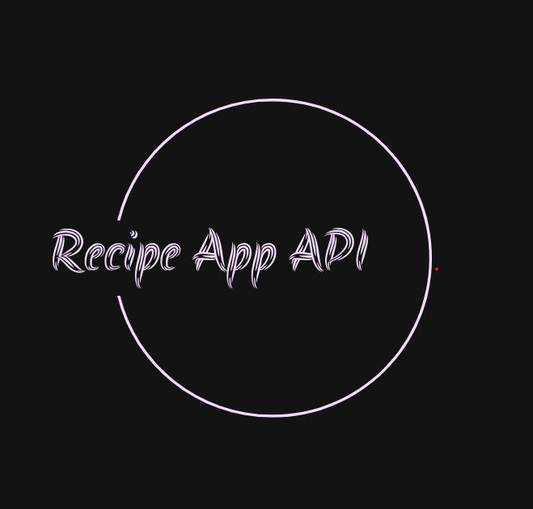
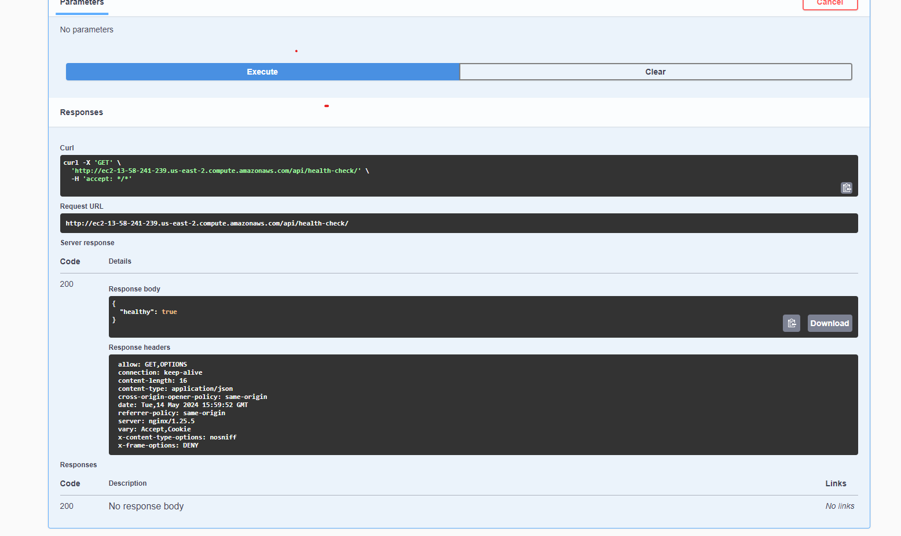

<!-- PROJECT SHIELDS -->
<!--
*** I'm using markdown "reference style" links for readability.
*** Reference links are enclosed in brackets [ ] instead of parentheses ( ).
*** See the bottom of this document for the declaration of the reference variables
*** for contributors-url, forks-url, etc. This is an optional, concise syntax you may use.
*** https://www.markdownguide.org/basic-syntax/#reference-style-links
-->
[![MIT License][license-shield]][license-url]
[![LinkedIn][linkedin-shield]][linkedin-url]


<!-- PROJECT LOGO -->
<br />
<div align="center">
  <a href="https://github.com/othneildrew/Best-README-Template">
    
  </a>

<h3 align="center">Recipe App API</h3>

  <p align="center">
    REST API to explore all the recipes, ingredients and tags from users
    <br />
    <a href="http://ec2-13-58-241-239.us-east-2.compute.amazonaws.com/api/docs/"><strong>Explore the docs »</strong></a>
    <br />
    <br />
    <a href="http://ec2-13-58-241-239.us-east-2.compute.amazonaws.com/api/user/create/">View Demo</a>
    ·
    <a href="https://github.com/francisco-oro/recipe-app-api/issues/new?labels=bug&template=bug-report---.md">Report Bug</a>
    ·
    <a href="https://github.com/francisco-oro/recipe-app-api/issues/new?labels=enhancement&template=feature-request---.md">Request Feature</a>
  </p>
</div>


<!-- TABLE OF CONTENTS -->
<details>
  <summary>Table of Contents</summary>
  <ol>
    <li>
      <a href="#about-the-project">About The Project</a>
      <ul>
        <li><a href="#built-with">Built With</a></li>
      </ul>
    </li>
    <li>
      <a href="#getting-started">Getting Started</a>
      <ul>
        <li><a href="#prerequisites">Prerequisites</a></li>
        <li><a href="#installation">Installation</a></li>
      </ul>
    </li>
    <li><a href="#usage">Usage</a></li>
    <li><a href="#roadmap">Roadmap</a></li>
    <li><a href="#contributing">Contributing</a></li>
    <li><a href="#license">License</a></li>
    <li><a href="#contact">Contact</a></li>
    <li><a href="#acknowledgments">Acknowledgments</a></li>
  </ol>
</details>


<!-- ABOUT THE PROJECT -->

## About The Project


The Recipe App API gives users access to their food recipes, store ingredients and tags assigned to them
and filter or sorter based on these items. The filtering and sorting of the recipes makes it easy
to search for recipes using clear queries, like `api/recipe/recipes/&tags=4,2&ingredients=3`

The API allows developers to:

- Handle user authentication
- Create new recipes, tags, and ingredients
- Filtering and sorting recipes by tags and/or ingredients
- Uploading and viewing images for recipes

### Built With

The technologies used for this project are listed below:

* [![PostgreSql][PostgreSql]][PostgreSql-Url]
* [![drf][drf]][drf-url]
* [![nginx][nginx]][nginx-url]
* [![aws][aws]][aws-url]
* [![swagger][swagger]][swagger-url]
* [![docker][docker]][docker-url]

<p align="right">(<a href="#readme-top">back to top</a>)</p>


<!-- GETTING STARTED -->

## Getting Started

This guide contains step-by-step instructions on how to get started with Recipe App API. This guide
shows you how to:

- Build and run the project image as a container
- Setup for development environment
- Setup for production environment
- Create a superuser and login to the admin site
- Start making requests to the server

To get started with Recipe App API, make sure you <a href="#prerequisites">meet the prerequisites</a>,
and follow the <a href="#installation">installation steps</a>.

OS requirements

### Prerequisites

#### Docker

You need Docker, docker-compose, and git setup on your machine. Refer
to <a href="https://docs.docker.com/guides/get-started/">Docker Documentation</a>.

### Installation

#### Local Setup

```shell
git clone https://github.com/francisco-oro/recipe-app-api.git
cd recipe-app-api 
docker-compose -f docker-compose.yml up
```

Wait for some time until the setup script creates a site. After that, you can access
`http://localhost:8000` in your browser and navigate to `http://localhost:8000/api/docs` in order
to access the swagger documentation

#### Deployment

```shell
git clone https://github.com/francisco-oro/recipe-app-api.git
cd recipe-app-api 
docker-compose -f docker-compose.yml up
```

1. Get a free API Key at [https://example.com](https://example.com)
2. Clone the repo
   ```sh
   git clone https://github.com/your_username_/Project-Name.git
   ```
3. Install NPM packages
   ```sh
   npm install
   ```
4. Enter your API in `config.js`
   ```js
   const API_KEY = 'ENTER YOUR API';
   ```

<p align="right">(<a href="#readme-top">back to top</a>)</p>


<!-- USAGE EXAMPLES -->

## Usage

### Create a new user


_For more examples, please refer to
the [Documentation](http://ec2-13-58-241-239.us-east-2.compute.amazonaws.com/api/docs/#/recipe/recipe_ingredients_list)_

<p align="right">(<a href="#readme-top">back to top</a>)</p>


<!-- ROADMAP -->

## Roadmap

- [x] App Design
- [x] Test Driven Development
- [x] System and Project Setup
- [x] Database
- [x] Token-Based authentication
- [x] API Documentation
- [x] User API
- [x] Recipe API
- [x] Tags API
- [x] Ingredients API
- [x] Recipe image API
- [x] Filtering
- [ ] Multi-language Support
    - [ ] Chinese
    - [ ] Spanish

See the [open issues](https://github.com/francisco-oro/recipe-app-api/issues) for a full list of proposed features (
and known issues).

<p align="right">(<a href="#readme-top">back to top</a>)</p>


<!-- CONTRIBUTING -->

## Contributing

Contributions are welcome

1. Fork the Project
2. Create your Feature Branch (`git checkout -b feature/AmazingFeature`)
3. Commit your Changes (`git commit -m 'Add some AmazingFeature'`)
4. Push to the Branch (`git push origin feature/AmazingFeature`)
5. Open a Pull Request

<p align="right">(<a href="#readme-top">back to top</a>)</p>


<!-- LICENSE -->

## License

Distributed under the BSL-1.0 License. See `LICENSE.txt` for more information.

<p align="right">(<a href="#readme-top">back to top</a>)</p>


<!-- CONTACT -->

## Contact

Francisco Oro - [@franciscooro101](https://twitter.com/franciscooro101) - francisco.oro@comunidad.unam.mx

Project Link: [https://github.com/francisco-oro/recipe-app-api](https://github.com/francisco-oro/recipe-app-api)

<p align="right">(<a href="#readme-top">back to top</a>)</p>


<!-- ACKNOWLEDGMENTS -->

## Acknowledgments

These resources were helpful to build this project

* [Choose an Open Source License](https://choosealicense.com)
* [GitHub Emoji Cheat Sheet](https://www.webpagefx.com/tools/emoji-cheat-sheet)
* [Malven's Flexbox Cheatsheet](https://flexbox.malven.co/)
* [Malven's Grid Cheatsheet](https://grid.malven.co/)
* [Img Shields](https://shields.io)
* [GitHub Pages](https://pages.github.com)
* [Font Awesome](https://fontawesome.com)
* [React Icons](https://react-icons.github.io/react-icons/search)

<p align="right">(<a href="#readme-top">back to top</a>)</p>


<!-- MARKDOWN LINKS & IMAGES -->
<!-- https://www.markdownguide.org/basic-syntax/#reference-style-links -->

[contributors-shield]: https://img.shields.io/github/contributors/othneildrew/Best-README-Template.svg?style=for-the-badge

[contributors-url]: https://github.com/othneildrew/Best-README-Template/graphs/contributors

[forks-shield]: https://img.shields.io/github/forks/othneildrew/Best-README-Template.svg?style=for-the-badge

[forks-url]: https://github.com/othneildrew/Best-README-Template/network/members

[stars-shield]: https://img.shields.io/github/stars/othneildrew/Best-README-Template.svg?style=for-the-badge

[stars-url]: https://github.com/othneildrew/Best-README-Template/stargazers

[issues-shield]: https://img.shields.io/github/issues/othneildrew/Best-README-Template.svg?style=for-the-badge

[issues-url]: https://github.com/othneildrew/Best-README-Template/issues

[license-shield]: https://img.shields.io/badge/License-BSD_2--Clause-orange.svg

[license-url]: https://github.com/othneildrew/Best-README-Template/blob/master/LICENSE.txt

[linkedin-shield]: https://img.shields.io/badge/-LinkedIn-black.svg?style=for-the-badge&logo=linkedin&colorB=555

[linkedin-url]: https://linkedin.com/in/francisco-oro

[product-screenshot]: images/screenshot.png

[Next.js]: https://img.shields.io/badge/next.js-000000?style=for-the-badge&logo=nextdotjs&logoColor=white

[Next-url]: https://nextjs.org/

[React.js]: https://img.shields.io/badge/React-20232A?style=for-the-badge&logo=react&logoColor=61DAFB

[React-url]: https://reactjs.org/

[Vue.js]: https://img.shields.io/badge/Vue.js-35495E?style=for-the-badge&logo=vuedotjs&logoColor=4FC08D

[Vue-url]: https://vuejs.org/

[Angular.io]: https://img.shields.io/badge/Angular-DD0031?style=for-the-badge&logo=angular&logoColor=white

[Angular-url]: https://angular.io/

[Svelte.dev]: https://img.shields.io/badge/Svelte-4A4A55?style=for-the-badge&logo=svelte&logoColor=FF3E00

[Svelte-url]: https://svelte.dev/

[Laravel.com]: https://img.shields.io/badge/Laravel-FF2D20?style=for-the-badge&logo=laravel&logoColor=white

[Laravel-url]: https://laravel.com

[Bootstrap.com]: https://img.shields.io/badge/Bootstrap-563D7C?style=for-the-badge&logo=bootstrap&logoColor=white

[Bootstrap-url]: https://getbootstrap.com

[JQuery.com]: https://img.shields.io/badge/jQuery-0769AD?style=for-the-badge&logo=jquery&logoColor=white

[JQuery-url]: https://jquery.com

[PostgreSql]: https://img.shields.io/badge/PostgreSQL-316192?style=for-the-badge&logo=postgresql&logoColor=white

[PostgreSql-url]: https://www.postgresql.org/

[django.com]: https://img.shields.io/badge/Django-092E20?style=for-the-badge&logo=django&logoColor=white

[django-url]: https://www.djangoproject.com/

[drf]: https://img.shields.io/badge/django%20rest-ff1709?style=for-the-badge&logo=django&logoColor=white

[drf-url]: https://www.django-rest-framework.org/

[docker]:  https://img.shields.io/badge/Docker-2CA5E0?style=for-the-badge&logo=docker&logoColor=white

[docker-url]: https://www.docker.com/

[nginx]: https://img.shields.io/badge/Nginx-009639?style=for-the-badge&logo=nginx&logoColor=white

[nginx-url]: https://nginx.org/en/

[swagger]: https://img.shields.io/badge/Swagger-85EA2D?style=for-the-badge&logo=Swagger&logoColor=white

[swagger-url]: https://swagger.io/

[aws]: https://img.shields.io/badge/Amazon_AWS-FF9900?style=for-the-badge&logo=amazonaws&logoColor=white

[aws-url]: https://aws.amazon.com/